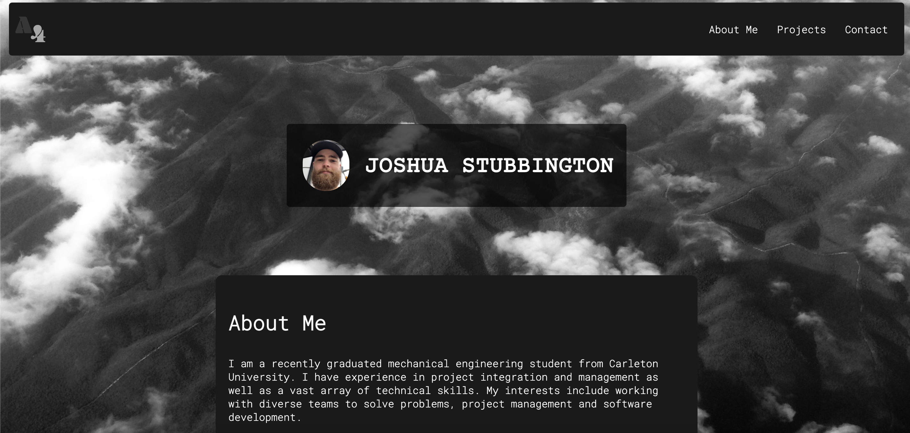

# Portfolio 
This portfolio is a page web page I have made from scratch. It includes a section about me, a section with links to projects I have completed (along with some placeholders) and lastly my contact information at the footer of the website. Clicking the links in the nav-bar will scroll a user to the corresponding section of the web page. This website can be viewed at all screen sizes. 

Here is a link to the deployed website:[Link to GitHub Pages Website](https://ayfor.github.io/portfolio/)

An image of the page when it initially loads can be seen below. 

